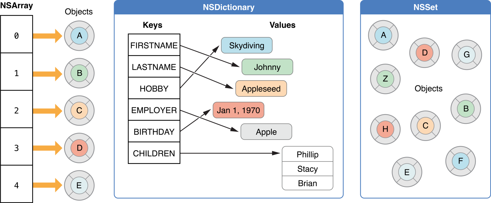
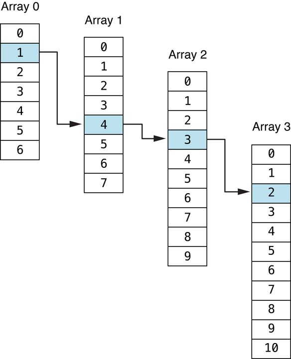

### NSArray,NSSet, NSDictionary 的区别

In Cocoa and Cocoa Touch, a collection is a Foundation framework class used for storing and managing groups of objects. Its primary role is to store objects in the form of either an `array`, a `dictionary`, or a `set`.

All collections share a number of common tasks, which include:

- Enumerating the objects in a collection
- Determining whether an object is in a collection
- Accessing individual elements in a collection

Mutable collections also allow some additional tasks:

- Adding objects to a collection
- Removing objects from a collection

### Accessing Indexes and Easily Enumerating Elements: Arrays

Arrays (such as `NSArray` and `NSMutableArray`) are ordered collections which allow indexed access to their contents. You might use an array to store the information to be presented in a table view because the order matters.

### Associating Data with Arbitrary Keys: Dictionaries

Dictionaries (such as `NSDictionary` and `NSMutableDictionary`) are unordered collections that allow keyed-value access to their contents. They also allow for fast insertion and deletion operations. Dictionaries are useful for storing values that have meaning based on their key. For example, you might have a dictionary of information about California, with capital as a key and Sacramento as the corresponding value.

### Offering Fast Insertion, Deletion, and Membership Checks: Sets

Sets (such as `NSSet` , `NSMutableSet`, and `NSCountedSet`) are unordered collections of objects. Sets allow for fast insertion and deletion operations. They also allow you to quickly see whether an object is in a collection. `NSSet` and `NSMutableSet` store collections of distinct objects, while `NSCountedSet` stores a collection of non-distinct objects. For example, suppose you have a number of city objects and you want to visit each one only once. If you store each city that you visit in a set, you can quickly and easily see whether you have visited it.

### Storing Subsets of Arrays: Index Sets

Index sets (such as `NSIndexSet` and `NSMutableIndexSet`) are helper objects that extend the capabilities of arrays. They allow you to store a subset of an array by storing the indexes into the array rather than by creating a new array. You might use an index set to allow a user to select multiple entries from a list of entries. For example, suppose you have a table view and you allow the user to select some of the rows. Because the rows are stored as an array, you could store the selections as an index set into that array.

### Storing Paths Through Nested Arrays: Index Paths

Index paths store the location of information in a more complicated collection hierarchy, specifically nested arrays. Cocoa provides the `NSIndexPath` class for this purpose. For example, the index path 1.4.3.2 specifies the path shown here:

### Customizing Memory and Storage Options: Pointer Collection Classes (OS X)

If you need collections to store arbitrary pointers or integers, or need to make use of zeroing weak references in a garbage-collected environment, there are the three pointer collection classes: `NSPointerArray`, `NSMapTable`, and `NSHashTable`. These are similar to `NSMutableArray`, `NSMutableDictionary`, and `NSMutableSet`, respectively. The three pointer collection classes allow additional options for specifying how the collection manages its contents. You can, for example, use pointer equality instead of invoking `isEqual:` during comparisons. Unlike all other collection classes, `NSPointerArray` is allowed to hold a `NULL` pointer.

### Working with Collections: Copying and Enumerating

In addition to class specific behavior, there are some tasks which are shared in similar form between the collection classes. Two of these tasks are copying a collection and enumerating its contents.

When you need to create a new collection with the contents of another, you can choose either a shallow or a deep copy into the other. In a shallow copy each object is retained when it is added to the new collection and ownership is shared by two or more collections. In a deep copy each object is sent a `copyWithZone:` message as it is added to the collection, instead of being retained.

If you need to check each item in a collection for some condition or to perform some action on the entries selectively, you can use one of the provided ways of enumerating the contents of a collection. The two main methods of enumeration are fast enumeration and block-based enumeration.

> [AppleDoc](https://developer.apple.com/library/archive/documentation/Cocoa/Conceptual/Collections/Collections.html)

